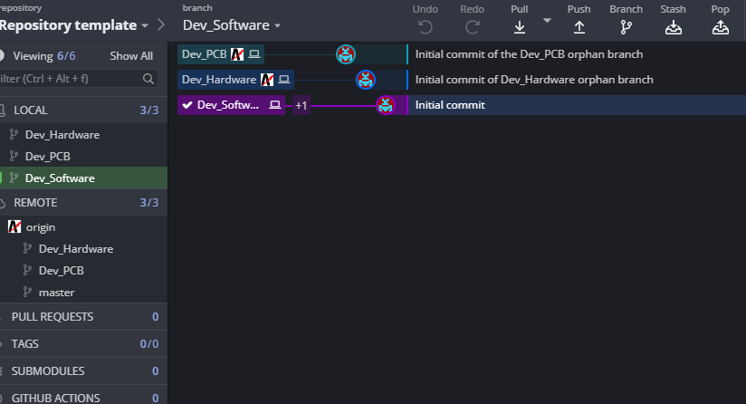

# Template

### __The following example is a template for a repository that have three pillars__
* __PCB design__ ( both schematic and pcb files)
* __Software__ (texts files)
* __Hardware__ (3D models etc.)

### __The division of the repository will be the following:__ 
* __Master__ Basic master branch used with Dev_Software
* __Dev_Software__ Normal branch created from the innicial commit of Master, used for Sofwares files
* __Dev_Hardware__ Orphan branch used for 3D models, drawnings & outputfiles.
* __Dev_PCB__ Orphan branch used for Alitum files ( Schematic/PCB/Projects files) 

On every branch of this template has a readme with more datails

### __How to create a orphan branch__
    git checkout --orphan orphan_name
    git rm -rf .
    rm '.gitignore'
    echo "#Title of Readme" > README.md
    git add README.md
    git commit -a -m "Initial Commit"
    git push origin orphan_name
    

